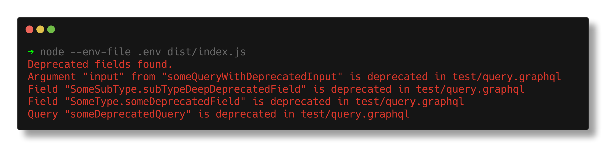

# graphql-lint-operations

This GitHub Action is used to validate operation files against a schema file.  
Any deprecated field will be reported and make the CI fail.



## Usage

You need the operation files (queries/mutations/subscriptions) and the schema file.  
[According to the GraphQL spec](https://spec.graphql.org/draft/#sec-Root-Operation-Types), the schema must define at least a field of the Query root type.

### Input parameters

| Parameter | Required | Default | Description |
| :- | :-: | :-: | :- |
| schema-file | :white_check_mark: | - | Path of the schema file. Only 1 file is supported ATM (eg `./some-dir/schema.graphql`) |
| operation-files-glob | :white_check_mark: | - | Glob to use (eg `./some-dir/**/*.graphql`) |
| report-files | :x: | `true` | If set to `false`, similar fields in different files won't be reported twice |

### Setup on GitHub

If you commit the schema file in the client codebase:

```yaml
- uses: actions/checkout@v4
- uses: digiz3d/graphql-lint-operations@v1
  with:
    schema-file: './wherever/you/put/the/schema.graphql'
    operation-files-glob: '**/*.graphql'
```

If you don't commit the schema, then you might fetch it using rover:

```yaml
- uses: actions/checkout@v4
- name: Install Rover
  run: |
    curl -sSL https://rover.apollo.dev/nix/latest | sh
    echo 'export PATH=$HOME/.rover/bin:$PATH' >> $BASH_ENV
- name: Fetch GraphQL schema
  run: rover graph fetch YourOrg@environment --output ./downloaded-schema.graphql
  env:
    APOLLO_KEY: ${{ secrets.APOLLO_KEY }}
- uses: digiz3d/graphql-lint-operations@v1
  with:
    schema-file: './downloaded-schema.graphql'
    operation-files-glob: '**/*.graphql'
```

## Tech details

Using [ncc](https://github.com/vercel/ncc) as a bundler.

`dist` is committed be able to run with a `node20` runner without any installation step.

This action does yet not scan object literals. It is fine as they are often replaced by variables in client operation files.  
Feel free to submit a PR (with tests) if you would like to support it.